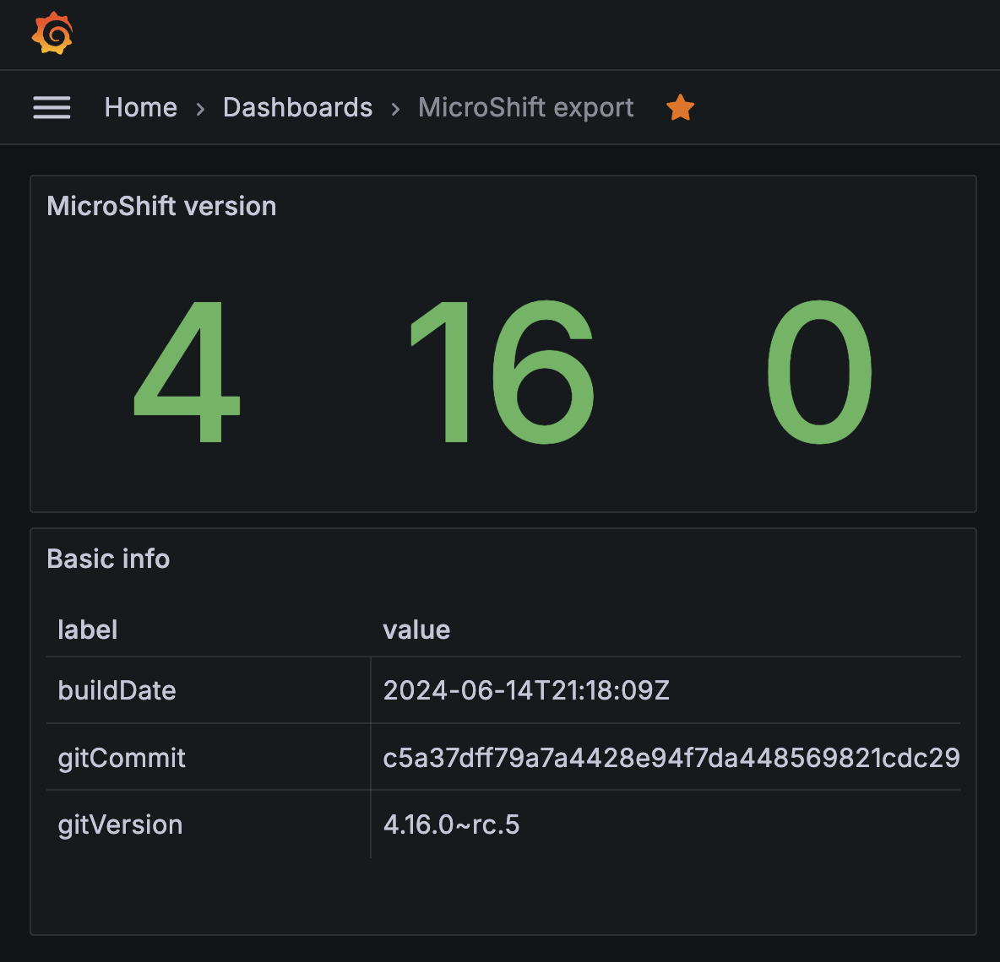

# MicroShift Prometheus exporter

A MicroShift Prometheus exporter to collect unique metrics from a MicroShift cluster

## Example current metrics
```
# HELP microshift_info MicroShift info
# TYPE microshift_info gauge
microshift_info{buildDate="2024-06-14T21:18:09Z",gitCommit="c5a37dff79a7a4428e94f7da448569821cdc2970",gitVersion="4.16.0~rc.5"} 1
# HELP microshift_version MicroShift version
# TYPE microshift_version gauge
microshift_version{level="major"} 4
microshift_version{level="minor"} 16
microshift_version{level="patch"} 0
```

## Example grafana dashboard


## TODO
- Collect more metrics:
    - Greenbot healthcheck status
    - ...
- Add support for 'x86_64' architecture
- Create an RPM to install the deployment and service definition in /usr/lib/microshift/manifests.d/
